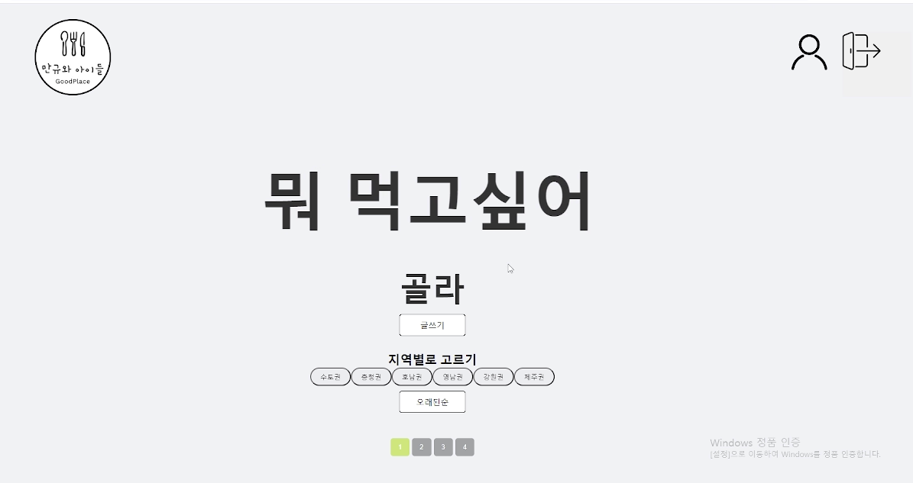

# 프로젝트 설명
"맛집 공유 서비스"는 사용자들이 전국의 숨겨진 맛집을 발견하고, 자신의 경험을 공유할 수 있는 플랫폼입니다. 이 서비스를 통해 사용자들은 맛집에 대한 리뷰를 작성하고, 다른 사용자의 리뷰를 읽으며 새로운 맛집을 발견할 수 있습니다. 우리의 목표는 사용자들이 쉽고 빠르게 정보를 공유하며 더 풍부한 식문화를 경험할 수 있게 하는 것입니다.

# 시연 영상
[](https://www.youtube.com/watch?v=ljB_05bE7oc)
# 팀 소개
> 팀명: 만규와 아이들 
> 
> 인원: 팀장 김만규, 팀원 이길현, 박서진, 이민준, 이성운

### 역할 분담
* 리더 : 김만규
  * 프론트 전체적 작업
* 팀원 : 이길현
  * 프론트 메인페이지 모달창 CSS 작업
* 팀원 : 박서진
  * 프론트 게시글 상세페이지 CSS 작업
* 팀원 : 이민준
  * 프론트 마이페이지 CSS 작업
* 팀원 : 이성운
  * 프론트 로그인, 회원가입, 메인페이지 CSS 작업

## 🔧기술 스택

### FRONTEND
   

### CO-OP TOOLS
     

## 프로젝트 설치 및 실행 방법

1. 저장소를 클론합니다:
    ```bash
    git clone https://github.com/fierceCry/share-site.git
    ```

2. 프로젝트 디렉토리로 이동합니다:
    ```bash
    cd share-site
    ```

3. 필요한 패키지를 설치합니다:
    ```bash
    npm install
    ```

4. 환경 변수를 설정합니다. `.env` 파일을 생성하고 다음과 같은 설정을 추가합니다:
    ```
    REACT_APP_API_URL=http://127.0.0.1:3000
    ```

5. 애플리케이션을 실행합니다:

    ```bash
    npm start (배포용)
    ```

    ```bash
    npm dev (개발용)
    ```

## API 명세서
[ 노션 바로가기](https://www.notion.so/teamsparta/ver-2024-e712a885d2624b388327f80a12051923?pvs=4)

## ERD
[ DrawSQL 바로가기](https://drawsql.app/teams/kimmangyu/diagrams/-2)

## 프론트 프로젝트 링크
[ 프론트 github 바로가기](https://github.com/fierceCry/share-site-FrontEnd.git)